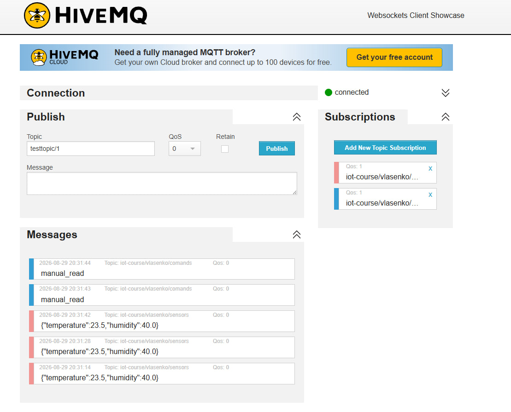
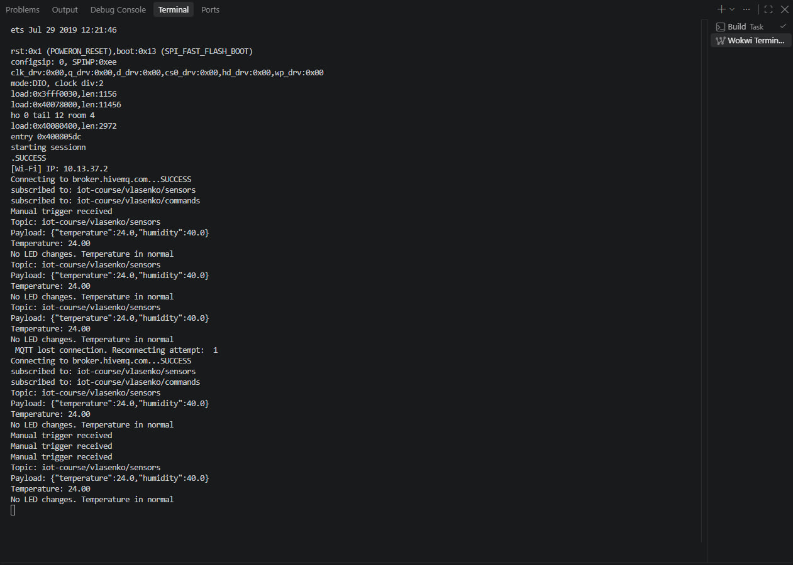

ESP_A публікує данні температуру та вологість на топік iot-course/vlasenko/sensors та команду мигання LED на топік iot-course/vlasenko/commands на брокер hivemq.com. І там і там використовується QoS 1.
На випадок проблем з данними DHT показники преевіряються isnan і данні заміняються на "null".

ESP_B підписується на ці обидва топіки з таким самим QoS 1, отримує данні температури та вологості, виводить їх в Serial та курує LED в залежності від отриманої температури (ON при високій температурі, OFF при низькій).
При отриманні manual read у топік iot-course/vlasenko/commands активується потрійне мигання світлодіодом та виводиться "Manual trigger received" у Serial. Якщо була отримана некоректна команда выводиться "Comand recived, but its not a trigger".
У разі втрати зв'язку з брокером обидва ESP32 пробують перепідключатись 3 рази, а потім перезавантажуються.

P.S.
Зараз побачив що розділення данних температури та вологості на окремі топіки було в умовах завдання і я це провтикав, так що дякую що не стали знаміти бал за це.