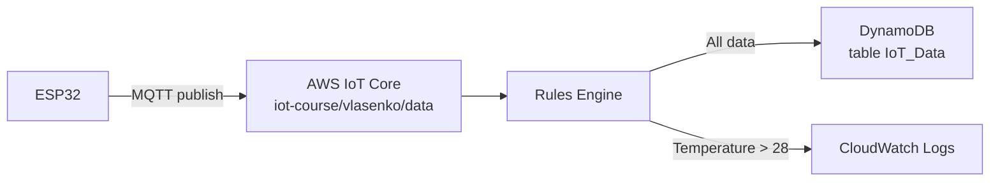

```mermaid
flowchart LR
    esp32["ESP32"]

    iot_core["AWS IoT Core<br/>iot-course/vlasenko/data"]
    iot_rule["Rules Engine"]
    dynamodb["DynamoDB<br/>table IoT_Data"]
    cloudwatch["CloudWatch Logs"]

    esp32 -->|"MQTT publish"| iot_core
    iot_core --> iot_rule
    iot_rule -->|"All data"| dynamodb
    iot_rule -->|"Temperature > 28"| cloudwatch
```

