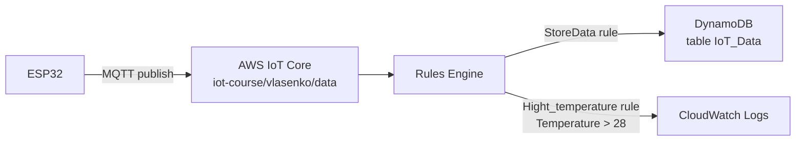

Policy:
{
  "Version": "2012-10-17",
  "Statement": [
    {
      "Effect": "Allow",
      "Action": "iot:Connect",
      "Resource": "arn:aws:iot:eu-north-1:042396229421:client/ESP32_Vlasenko_Homework_5"
    },
    {
      "Effect": "Allow",
      "Action": "iot:Publish",
      "Resource": "arn:aws:iot:eu-north-1:042396229421:topic/iot-course/vlasenko/data"
    }
  ]
}

