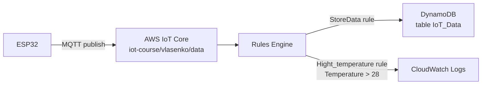
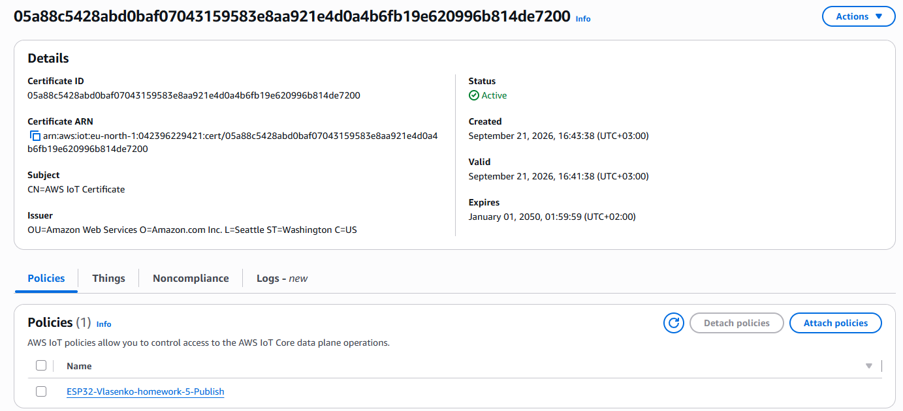
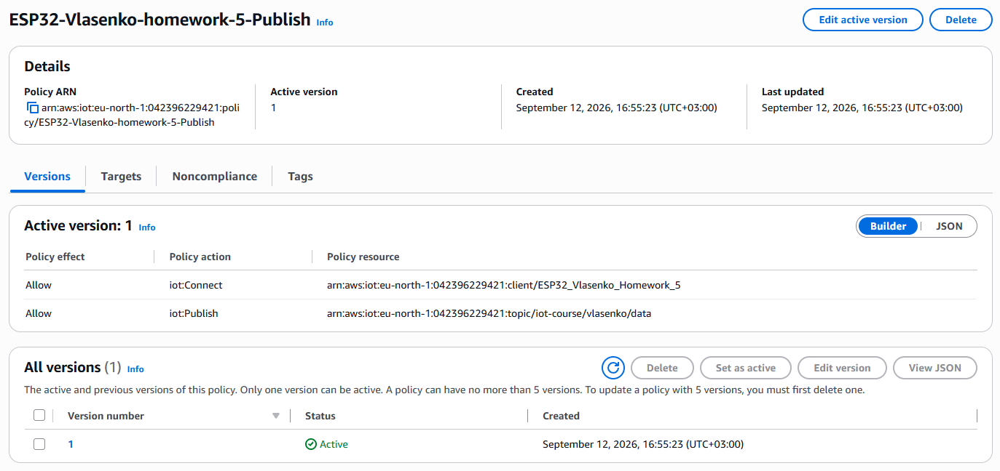
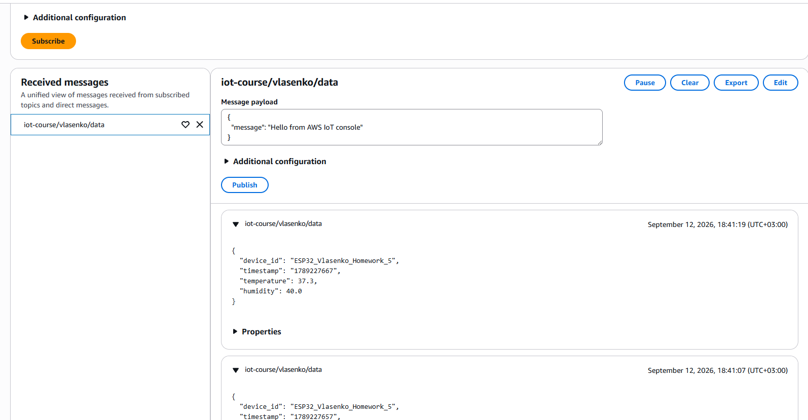
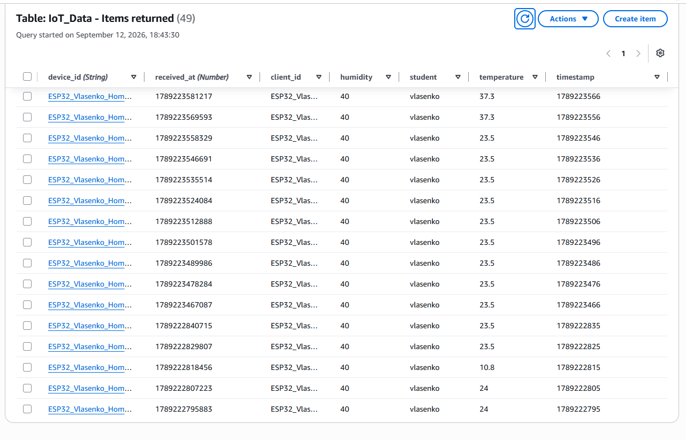
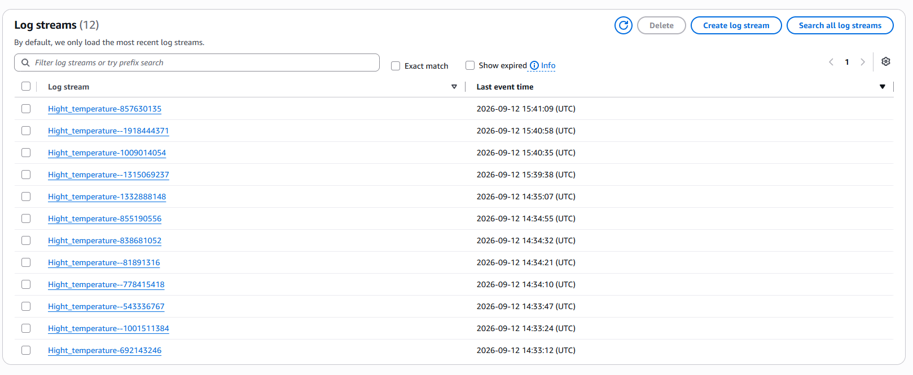
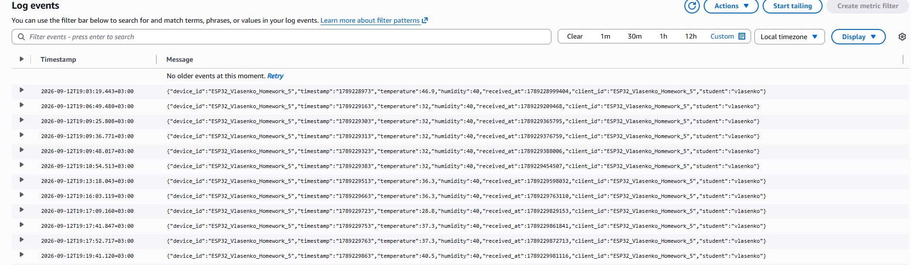

До сертифікату прив'язаний Policy "ESP32-Vlasenko-homework-5-Publish"

Ось його вміст:
{
  "Version": "2012-10-17",  
  "Statement": [  
    {
      "Effect": "Allow",  
      "Action": "iot:Connect",  
      "Resource": "arn:aws:iot:eu-north-1:042396229421:client/ESP32_Vlasenko_Homework_5"  
    },  
    {  
      "Effect": "Allow",  
      "Action": "iot:Publish",  
      "Resource": "arn:aws:iot:eu-north-1:042396229421:topic/iot-course/vlasenko/data"  
    }  
  ]  
} 

В rules engine є два правила:

StoreData зберігає данні в DunamoBD таблицю IoT_Data та має Error Action який логує помилку в CloudWatch групу "iot-errors"

Hight_temperature логує в CloudWatch групу "logs" данні в який температуре більше 28

SQL statement для StoreData:
SELECT *,
timestamp() AS received_at,
clientid()  AS client_id,
topic(2)    AS student
FROM 'iot-course/vlasenko/data'

SQL statement для Hight_temperature:
SELECT *,
timestamp() AS received_at,
clientid() AS client_id, 
topic(2) AS student
FROM 'iot-course/vlasenko/data'
WHERE temperature > 28

