# ДЗ 6 — ESP32, AWS IoT та Grafana

У проєкті реалізовано обмін даними в обидва боки: ESP32 надсилає показники DHT22 у хмару та отримує команди керування LED. Телеметрія й підтвердження команд зберігаються в DynamoDB і відображаються в Grafana.

FastAPI та HTML-сторінку взято з матеріалів курсу. У бекенді додано читання подій LED; HTML використано без змін. На ESP32 реалізовано публікацію підтверджень `led_changed`, а в Grafana — окрему панель Table для цих подій.

У `FastAPI/db.py` я додав підключення до окремої таблиці подій через `EVENTS_TABLE_NAME` та функцію `get_events()`. Вона вибирає до 30 останніх подій потрібного пристрою й повертає їх від нових до старих.

У `FastAPI/main.py` додав endpoint `GET /sensors/events`, який викликає цю функцію. Через нього панель Table у Grafana отримує підтвердження зміни стану LED.

## Архітектура

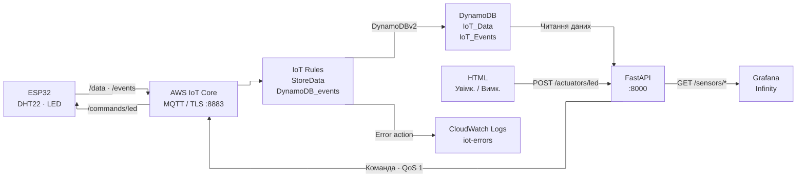

DHT22 підключений до GPIO 4, LED — до GPIO 2.

| MQTT-топік | Дані |
|---|---|
| `iot-course/vlasenko/data` | `device_id`, `timestamp`, `temperature`, `humidity` |
| `iot-course/vlasenko/commands/led` | `{"action":"set","value":"on"}` або `{"action":"set","value":"off"}` |
| `iot-course/vlasenko/events` | `device_id`, `timestamp`, `event: "led_changed"`, `value: "on" / "off"` |

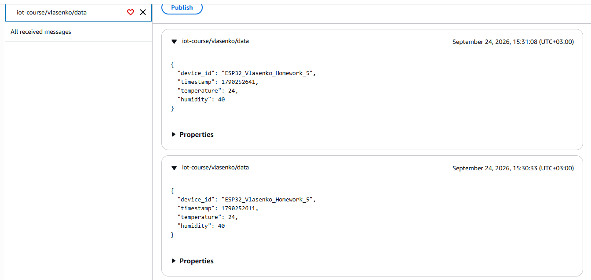
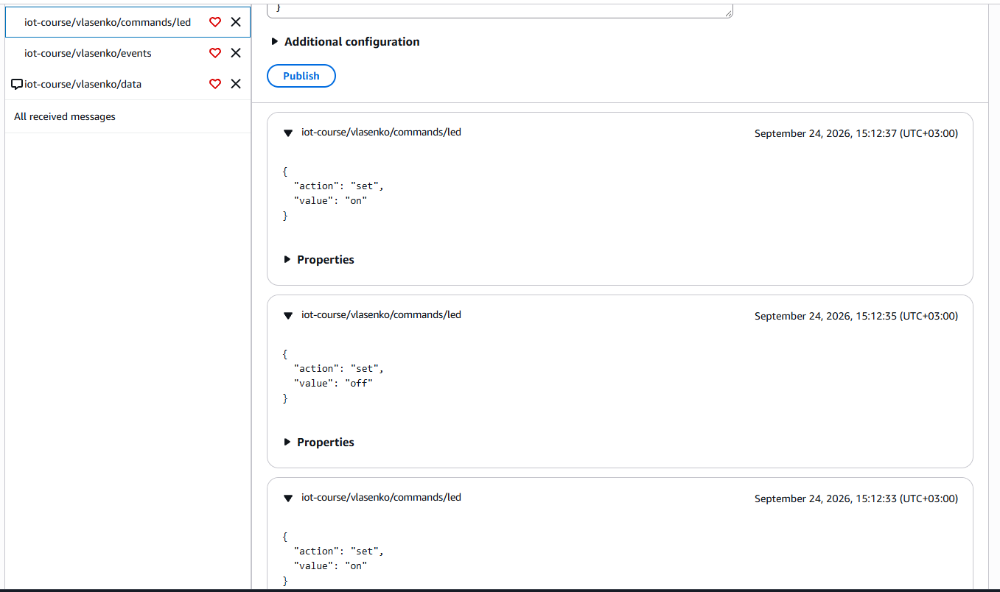
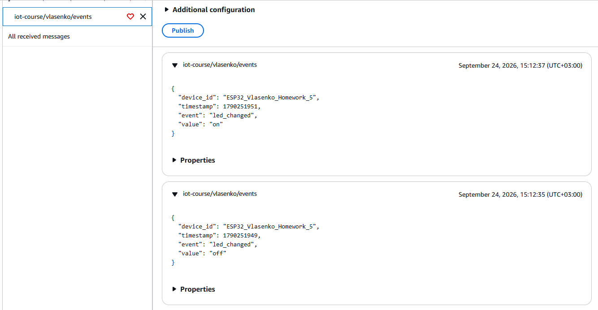

Thing використовується з попереднього ДЗ.

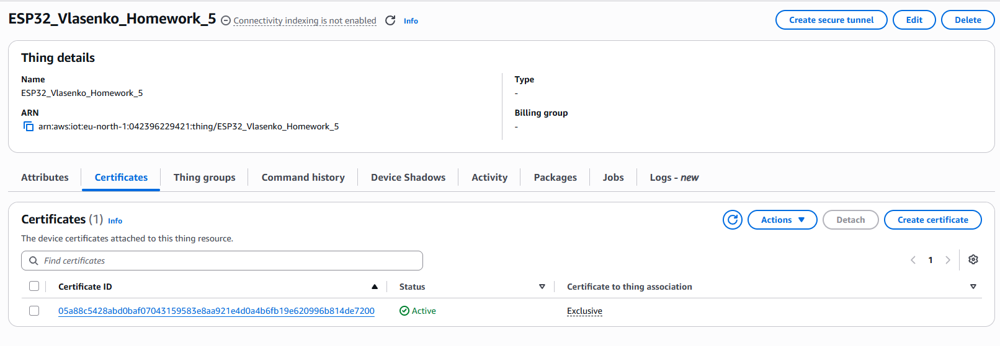

## Ресурси AWS

| Ресурс | Назва |
|---|---|
| Thing / MQTT Client ID          | `ESP32_Vlasenko_Homework_5` |
| IoT Policy                      | `ESP32-Vlasenko-homework-5-Publish`|
| Rule телеметрії                 | `StoreData`, топік `iot-course/vlasenko/data` |
| Rule подій                      | `DynamoDB_events`, топік `iot-course/vlasenko/events` |
| Сертифікат пристрою             | активний, прив’язаний до Thing та `ESP32-Vlasenko-homework-5-Publish` |
| Таблиці DynamoDB                | `IoT_Data`, `IoT_Events` |
| CloudWatch Log Group            | `iot-errors` — помилки через Error action усіх IoT Rules |
| IAM-користувач / Policy бекенда | `IoT_backend` / `IoT_backend_HW6` |
| IAM-ролі запису в DynamoDB      | `iot_rule_ddb_role` / `iot-dynamodb-events-role` |
| IAM-ролі Error action           | `CloudWatch-error-role` / `iot_cloudwatch_role` |

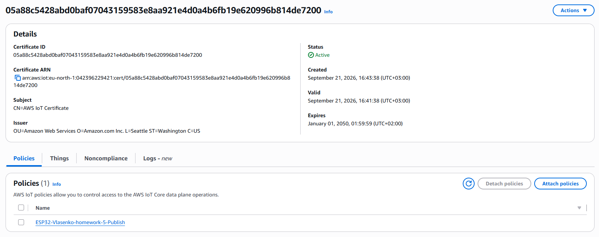

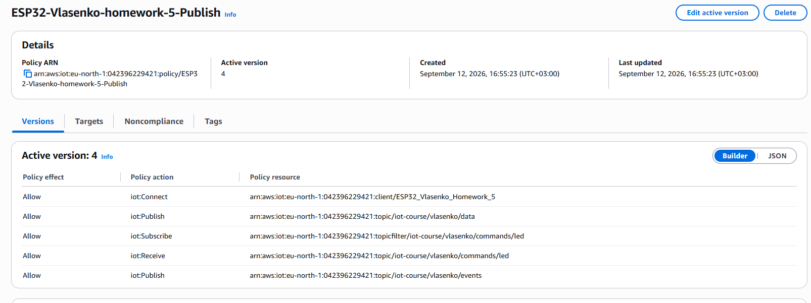

Для таблиць використовується ключ `device_id` (String) і ключ сортування `received_at` (Number).

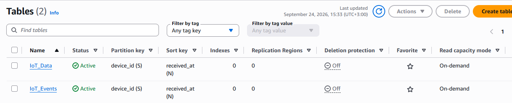
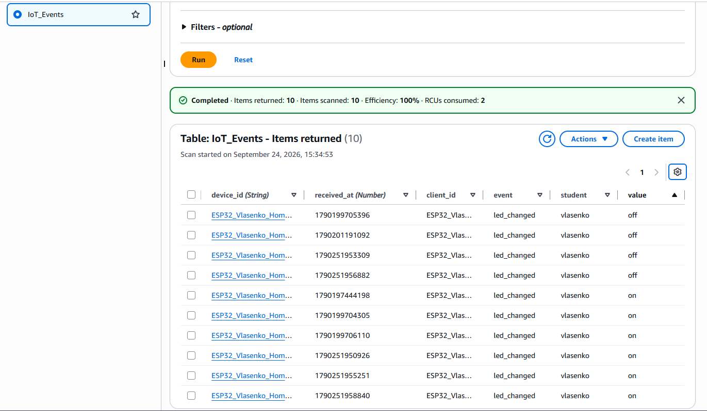
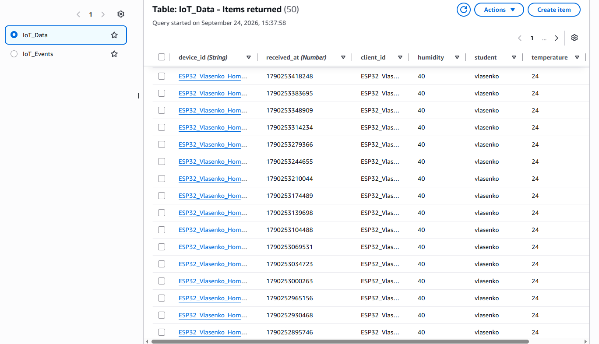

SQL обох IoT Rules:

```sql
-- StoreData
SELECT *, 
timestamp() AS received_at, 
clientid() AS client_id, 
topic(2) AS student
FROM 'iot-course/vlasenko/data'

-- DynamoDB_events
SELECT *, 
timestamp() AS received_at, 
clientid() AS client_id, 
topic(2) AS student
FROM 'iot-course/vlasenko/events'
```

Пристрою дозволено підключення, публікацію телеметрії й подій та отримання команд. Політика бекенда дозволяє `dynamodb:Query` на обидві таблиці та `iot:Publish` на топік команд. 

Ролі правил запису потрібен `dynamodb:PutItem` у відповідні таблиці:

Для IoT_Events:

```json
{
    "Version": "2012-10-17",
    "Statement": {
        "Effect": "Allow",
        "Action": "dynamodb:PutItem",
        "Resource": "arn:aws:dynamodb:eu-north-1:042396229421:table/IoT_Events"
    }
}
```

Для IoT_Data:

```json
{
    "Version": "2012-10-17",
    "Statement": {
        "Effect": "Allow",
        "Action": "dynamodb:PutItem",
        "Resource": "arn:aws:dynamodb:eu-north-1:042396229421:table/IoT_Data"
    }
}
```

IoT Policy пристрою

```json
{
  "Version": "2012-10-17",
  "Statement": [
    {
      "Effect": "Allow",
      "Action": "iot:Connect",
      "Resource": "arn:aws:iot:eu-north-1:042396229421:client/ESP32_Vlasenko_Homework_5"
    },
    {
      "Effect": "Allow",
      "Action": "iot:Publish",
      "Resource": "arn:aws:iot:eu-north-1:042396229421:topic/iot-course/vlasenko/data"
    },
    {
      "Effect": "Allow",
      "Action": "iot:Subscribe",
      "Resource": "arn:aws:iot:eu-north-1:042396229421:topicfilter/iot-course/vlasenko/commands/led"
    },
    {
      "Effect": "Allow",
      "Action": "iot:Receive",
      "Resource": "arn:aws:iot:eu-north-1:042396229421:topic/iot-course/vlasenko/commands/led"
    },
    {
      "Effect": "Allow",
      "Action": "iot:Publish",
      "Resource": "arn:aws:iot:eu-north-1:042396229421:topic/iot-course/vlasenko/events"
    }
  ]
}
```

IAM Policy бекенда

```json
{
  "Version": "2012-10-17",
  "Statement": [
    {
      "Sid": "DynamoDBRead",
      "Effect": "Allow",
      "Action": "dynamodb:Query",
      "Resource": [
        "arn:aws:dynamodb:eu-north-1:042396229421:table/IoT_Data",
        "arn:aws:dynamodb:eu-north-1:042396229421:table/IoT_Events"
      ]
    },
    {
      "Sid": "IoTPublish",
      "Effect": "Allow",
      "Action": "iot:Publish",
      "Resource": [
        "arn:aws:iot:eu-north-1:042396229421:topic/iot-course/vlasenko/commands/led"
      ]
    }
  ]
}
```

## Локальний запуск

**ESP32:** відкрити `ESP32/` у VS Code з PlatformIO та Wokwi. Скопіювати `src/secrets.example.h` у `src/secrets.h`, заповнити Wi-Fi, AWS endpoint, Thing і сертифікати з ключем. Запуск: **PlatformIO: Build → Wokwi: Start Simulator**.

**FastAPI:** створити `.env` із `FastAPI/.env.example`, заповнити AWS-ключі та звірити регіон, назви таблиць і `DEVICE_ID` (має збігатися з `THINGNAME`).
Запуск із теки `FastAPI/` після встановлення залежностей із `requirements.txt` та активації віртуального оточення:

```powershell
fastapi dev main.py
```

API: [localhost:8000/docs](http://localhost:8000/docs). **HTML:** відкрити `HTML/index.html` через Live Server на порту `5501`; адреса бекенда в сторінці — `http://localhost:8000`.

## Grafana

| Панель | Дані API |
|---|---|
| Time series | температура за останні 30 хвилин — `/sensors/history?minutes=30` |
| Gauge | поточна вологість — `/sensors/latest` |
| Stat | останній `received_at` — `/sensors/latest` |
| Table | час, стан LED та пристрій — `/sensors/events` |

Grafana доступна локально на порту `3000`.

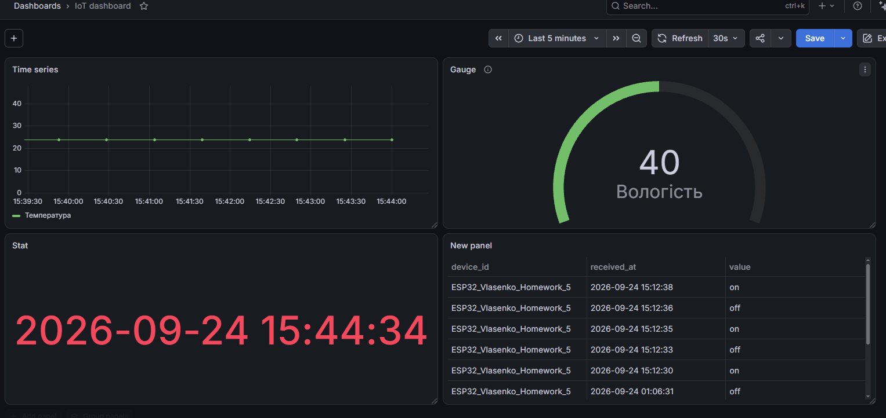


